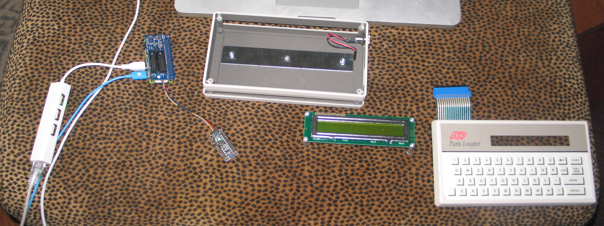
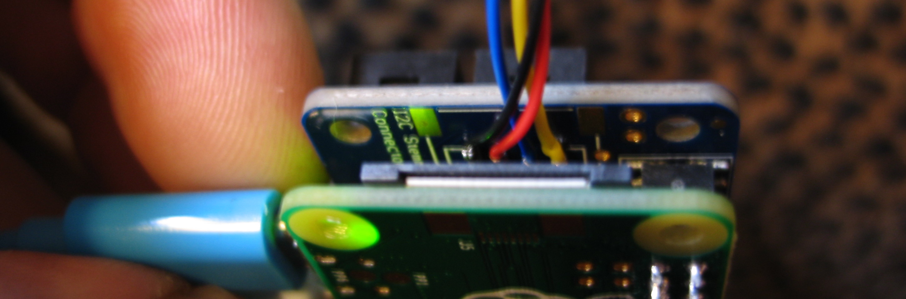
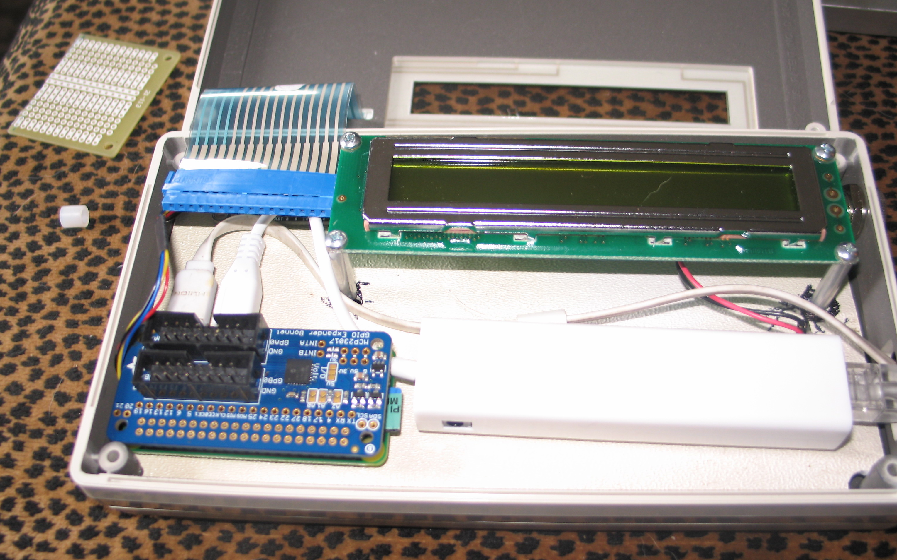
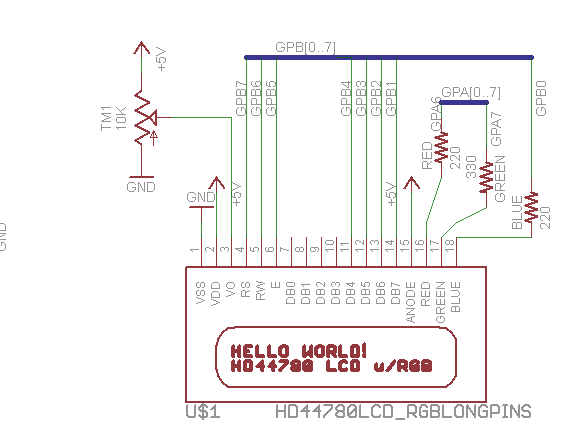
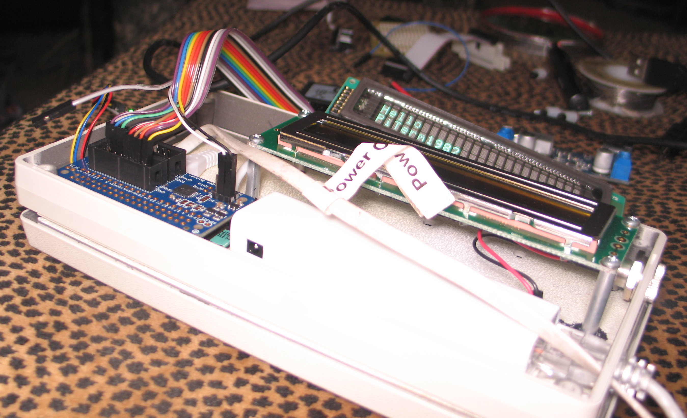

# PiTerm1986
**GOAL:** Convert 80s style user interface ( 8031 based ADP Product: chicklet keyboard and 2x20 lcd ) to pi zero based terminal using i2c based io expanders.


Looking under the keyboard membrane and tracing the connectors we can get the following key map under a 4x12 array (16 pins).

```
   0123456789A(10)B(11)
   --------------------
0) *# ZXCVBNM/    <STOP>
1) -LASDFGHJK<N/C><ENTER>
2) 0912345678<BS> <START>
3) POQWERTYUI<CAN><DIAL>
```
<table>
<tr><td>*</td><td>#</td><td> </td><td>Z</td><td>X</td><td>C</td><td>V</td><td>B</td><td>N</td><td>M</td><td>/</td><td>STOP</td></tr>
<tr>
<td>&#45;</td><td>L</td><td>A</td><td>S</td><td>D</td><td>F</td><td>G</td><td>H</td><td>J</td><td>K</td><td>N/C</td><TD>ENTER</TD></tr>
<tr>
<td>0</td><td>9</td><td>1</td><td>2</td><td>3</td><td>4</td><td>5</td><td>6</td><td>7</td><td>8</td><td>&LT;----</td><td>START</td></tr>
<tr>
<td>P</td><td>O</td><td>Q</td><td>W</td><td>E</td><td>R</td><td>T</td><td>Y</td><td>U</td><td>I</td><td>CANCEL</td><td>DIAL</td></tr>
</table>
### Keyboard


For this we look at the AW9523 GPIO expander with 16 pins of io.

### LCD/VFD 

Since the LCD is a 5v circuit requiring either 8 or 12 pins we look at the Microchip MCP23017 on the Adafruit GPIO Expander Bonnet which we can wire either using both ports or one port in nibble mode. 


### Attaching Both Boards to the Raspberry pi.




```
root@somepi1:/home/feurig# i2cdetect -y 1
     0  1  2  3  4  5  6  7  8  9  a  b  c  d  e  f
00:          -- -- -- -- -- -- -- -- -- -- -- -- -- 
10: -- -- -- -- -- -- -- -- -- -- -- -- -- -- -- -- 
20: 20 -- -- -- -- -- -- -- -- -- -- -- -- -- -- -- 
30: -- -- -- -- -- -- -- -- -- -- -- -- -- -- -- -- 
40: -- -- -- -- -- -- -- -- -- -- -- -- -- -- -- -- 
50: -- -- -- -- -- -- -- -- 58 -- -- -- -- -- -- -- 
60: -- -- -- -- -- -- -- -- -- -- -- -- -- -- -- -- 
70: -- -- -- -- -- -- -- --                         
```

## Assembly and layout.
After putting the board in the box I realized that the grey paint was conductive and that I almost let the smoke out of the pi zero. (you could smell it). So I went out and found a piece of plastic from a previous project. 



### So there's a circuitpython library for an mcp23017 connected to an lcd.

```
root@somepi1:/home/feurig# pip3 install adafruit-circuitpython-charlcd
...
```



I am not thrilled about the way its wired but whatever.

## And then I was like OH SHIT I have Noritake 2x24 VFD thats a close fit..

Wiring it up according to the above schematic lets us write away

```
root@somepi1:/home/feurig# python3
Type "help", "copyright", "credits" or "license" for more information.
>>> import board
>>> import busio
>>> import adafruit_character_lcd.character_lcd_rgb_i2c as character_lcd
>>> lcd_columns = 24
>>> lcd_rows = 2
>>> i2c = busio.I2C(board.SCL, board.SDA)
>>> lcd = character_lcd.Character_LCD_RGB_I2C(i2c, lcd_columns, lcd_rows)
>>> lcd.message = "Hello\nPiTerm1986"
>>> lcd.clear()
>>> lcd.message = "Hello\nPiTerm1982"
>>> 
```




# References
* [https://learn.adafruit.com/adafruit-aw9523-gpio-expander-and-led-driver](https://learn.adafruit.com/adafruit-aw9523-gpio-expander-and-led-driver)
* [AW9523 Datasheet](https://cdn-shop.adafruit.com/product-files/4886/AW9523+English+Datasheet.pdf)
* [https://learn.adafruit.com/gpio-expander-bonnet/overview](https://learn.adafruit.com/gpio-expander-bonnet/overview)
* [MCP23017 Datasheet](http://ww1.microchip.com/downloads/en/devicedoc/20001952c.pdf)
* [https://protostack.com.au/2010/03/character-lcd-displays-part-1/](https://protostack.com.au/2010/03/character-lcd-displays-part-1/)
* [https://www.electronicsforu.com/technology-trends/learn-electronics/16x2-lcd-pinout-diagram](https://www.electronicsforu.com/technology-trends/learn-electronics/16x2-lcd-pinout-diagram)


